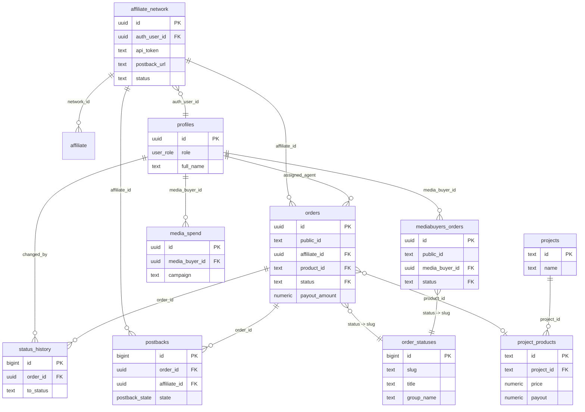

# Schéma de la base de données — VORALIS CRM

Base **PostgreSQL** (Supabase). Généré par introspection directe du schéma
live (API PostgREST + contenu réel de `order_statuses`), pas seulement à
partir des fichiers `supabase/*.sql` — certains ont divergé du schéma réel
au fil des migrations (voir §6).

Pour le cycle de vie métier des statuts, la mécanique de payout et le détail
des politiques RLS, voir aussi [`data-model.md`](./data-model.md). Ce document
se concentre sur la structure : tables, colonnes, types, clés.

---

## 1. Diagramme des relations

---

## 2. Types énumérés (enums Postgres)

Seules deux colonnes utilisent encore un vrai enum Postgres ; les statuts de
commande (`orders.status`, `mediabuyers_orders.status`) n'en sont **plus**
un depuis `migrate_status_unlimited.sql` (voir §5 et §6).

| Enum | Valeurs réelles (live) | Colonnes qui l'utilisent |
|------|------|------|
| `user_role` | `admin`, `agent`, `affiliate`, `media_buyer` | `profiles.role` |
| `postback_state` | `pending`, `sent`, `failed` | `postbacks.state` |

> ⚠️ `agent` existe toujours dans le type `user_role` (Postgres ne permet pas
> de retirer une valeur d'enum facilement) mais n'est plus assigné à aucun
> profil — `migrate_roles.sql` a migré les lignes existantes vers `admin`
> sans modifier le type lui-même.

---

## 3. Tables métier principales

### `profiles` — comptes (1:1 avec `auth.users`)
| Colonne | Type | Contrainte |
|---|---|---|
| `id` | uuid | **PK**, = `auth.users.id` |
| `role` | `user_role` | défaut `affiliate` |
| `full_name` | text | nullable |
| `created_at` | timestamptz | défaut `now()` |

Créée automatiquement à l'inscription (trigger `on_auth_user_created`).

### `affiliate_network` — comptes partenaires (modèle actuel)
| Colonne | Type | Contrainte |
|---|---|---|
| `id` | uuid | **PK**, défaut `gen_random_uuid()` |
| `auth_user_id` | uuid | FK → `profiles.id`, nullable |
| `name` | text | requis |
| `email` | text | nullable |
| `api_token` | text | requis, unique (format `vrl_live_…`) |
| `postback_url` | text | nullable, gabarit avec macros |
| `postback_method` | text | défaut `GET` |
| `signature_secret` | text | défaut auto-généré (HMAC POST) |
| `status` | text | défaut `active` |
| `created_at` | timestamptz | défaut `now()` |

### `affiliate` — sous-affiliés / sources de tracking
| Colonne | Type | Contrainte |
|---|---|---|
| `id` | uuid | **PK**, défaut `gen_random_uuid()` |
| `name` | text | requis |
| `network_id` | uuid | FK → `affiliate_network.id` |
| `created_at` | timestamptz | défaut `now()` |

### `orders` — leads (table pivot)
| Colonne | Type | Contrainte |
|---|---|---|
| `id` | uuid | **PK**, défaut `gen_random_uuid()` |
| `public_id` | text | requis, unique — voir §5 (nuance sur le défaut réel) |
| `affiliate_id` | uuid | FK → `affiliate_network.id`, requis |
| `product_id` | text | FK → `project_products.id`, nullable |
| `product` | text | nom libre (résolu ou brut) |
| `first_name` | text | requis |
| `last_name` | text | nullable |
| `phone` | text | requis |
| `country` | text | nullable, 2–3 lettres |
| `address`, `city` | text | nullable |
| `quantity` | integer | défaut `1` |
| `ip`, `user_agent` | text | nullable |
| `affiliate` | text | sous-affilié/source (texte libre) |
| `sub1` … `sub5` | text | nullable, tracking libre |
| `comment` | text | nullable |
| `status` | text | FK → `order_statuses.slug`, défaut `new` |
| `assigned_agent` | uuid | FK → `profiles.id`, nullable |
| `payout_amount` | numeric | nullable |
| `payout_currency` | character | nullable |
| `paid_at` | timestamptz | nullable |
| `confirmed_at` / `delivered_at` | timestamptz | nullable |
| `exported_at` | timestamptz | nullable |
| `created_at` / `updated_at` | timestamptz | défaut `now()`, `updated_at` via trigger |

### `status_history` — audit des changements de statut
| Colonne | Type | Contrainte |
|---|---|---|
| `id` | bigint | **PK**, identity |
| `order_id` | uuid | FK → `orders.id` (cascade) |
| `from_status` | text | nullable |
| `to_status` | text | requis |
| `changed_by` | uuid | FK → `profiles.id`, nullable |
| `note` | text | nullable |
| `created_at` | timestamptz | défaut `now()` |

### `postbacks` — file d'attente des notifications
| Colonne | Type | Contrainte |
|---|---|---|
| `id` | bigint | **PK**, identity |
| `order_id` | uuid | FK → `orders.id` (cascade) |
| `affiliate_id` | uuid | FK → `affiliate_network.id` (cascade) |
| `status` | text | requis (statut au moment de l'enfilage) |
| `method` | text | défaut `GET` |
| `url` | text | nullable, résolue au moment de l'envoi |
| `payload` | jsonb | nullable |
| `attempts` | integer | défaut `0` |
| `max_attempts` | integer | défaut `4` |
| `http_status` | integer | nullable |
| `response_body` | text | nullable |
| `state` | `postback_state` | défaut `pending` |
| `last_attempt_at` | timestamptz | nullable |
| `created_at` | timestamptz | défaut `now()` |

---

## 4. Tables media buying

### `mediabuyers_orders` — commandes saisies par les media buyers
| Colonne | Type | Contrainte |
|---|---|---|
| `id` | uuid | **PK**, défaut `gen_random_uuid()` |
| `public_id` | text | requis, unique (séquence `mb_order_seq`) |
| `media_buyer_id` | uuid | FK → `profiles.id`, nullable |
| `product`, `country` | text | nullable |
| `first_name` | text | requis |
| `last_name` | text | nullable |
| `phone` | text | requis |
| `address`, `city` | text | nullable |
| `quantity` | integer | défaut `1` |
| `campaign` | text | nullable |
| `status` | text | FK → `order_statuses.slug`, défaut `new` |
| `payout_amount` | numeric | nullable |
| `payout_currency` | character | nullable |
| `comment` | text | nullable |
| `paid_at` | timestamptz | nullable |
| `created_at` / `updated_at` | timestamptz | défaut `now()` |

### `media_spend` — dépenses publicitaires
| Colonne | Type | Contrainte |
|---|---|---|
| `id` | uuid | **PK**, défaut `gen_random_uuid()` |
| `media_buyer_id` | uuid | FK → `profiles.id`, nullable |
| `date` | date | défaut `CURRENT_DATE` |
| `buyer_name`, `country` | text | nullable |
| `campaign` | text | requis |
| `amount_usd` | numeric | défaut `0` |
| `note` | text | nullable |
| `created_at` | timestamptz | défaut `now()` |

### `leads_mediabuyers` — ⚠️ table orpheline
| Colonne | Type |
|---|---|
| `lead_id` | text **PK** |
| `lead_date` | timestamptz |
| `full_name`, `phone`, `city`, `product`, `source_url`, `status`, `comment_1`, `comment_2`, `aff` | text |
| `utm_source`, `utm_medium`, `utm_campaign`, `utm_content`, `utm_term` | text |
| `ad_account_id` | text |
| `created_at` / `updated_at` | timestamptz |

> Présente en base mais **aucun fichier `supabase/*.sql` ne la crée et aucun
> code applicatif (`src/`) ne la référence**. Probablement un import manuel
> ou un reliquat d'un ancien flux (Facebook Ads ?). À vérifier avant de s'y
> fier — elle n'est pas maintenue par l'application actuelle.

---

## 5. Tables catalogue & configuration

### `projects` — portefeuilles de produits
| Colonne | Type | Contrainte |
|---|---|---|
| `id` | text | **PK** |
| `name` | text | requis |
| `created_at` | date | défaut `CURRENT_DATE` |
| `expires_at` | date | requis |
| `product_count` | integer | défaut `0` |

### `project_products` — catalogue produits
| Colonne | Type | Contrainte |
|---|---|---|
| `id` | text | **PK** |
| `project_id` | text | FK → `projects.id` (cascade) |
| `name` | text | requis |
| `description`, `measure`, `country`, `category`, `working_hours` | text | nullable |
| `price` | numeric | défaut `0` (devise locale) |
| `quantity` | integer | défaut `0` |
| `daily_capacity` | integer | défaut `0` |
| `confirmation_rate` | numeric | défaut `0` |
| `payout` | numeric | défaut `0` (toujours en USD) |
| `payout_model` | text | défaut `delivered` (`confirmed`\|`delivered`) |
| `currency` | text | défaut `USD` |
| `status` | text | défaut `active` |
| `image_url` | text | nullable |
| `created_at` | date | défaut `CURRENT_DATE` |

### `order_statuses` — statuts de commande (données, pas un enum)
| Colonne | Type | Contrainte |
|---|---|---|
| `id` | bigint | **PK**, identity |
| `slug` | text | unique — c'est la valeur stockée dans `orders.status` |
| `title` | text | requis (libellé affiché) |
| `group_name` | text | requis (regroupement UI) |
| `hide_date_from_affiliates` | boolean | défaut `false` |
| `sort_label` | text | défaut `Par date de commande` |
| `color` | text | défaut classes Tailwind `bg-slate-100 text-slate-700` |
| `created_at` | timestamptz | défaut `now()` |

**Contenu réel actuel (live, 14 lignes — géré depuis l'admin, peut évoluer) :**

| slug | title | group_name |
|---|---|---|
| `new` | Nouveau | en traitement |
| `processing` | En traitement | en traitement |
| `no_answer` | Injoignable | en traitement |
| `callback` | Rappel programmé | en traitement |
| `confirmed` | Confirmé | confirmé |
| `test_confirmed` | Test confirmé | confirmé |
| `shipped` | Expédié | confirmé |
| `in_delivery` | En livraison | confirmé |
| `delivered` | Livré | confirmé |
| `returned` | Retourné | confirmé |
| `rejected` | Annulé (client) | annulé |
| `cancelled` | Annulé | annulé |
| `duplicate` | Doublon | double |
| `spam` | Spam/Erreur | spam/erreur |

> `test_confirmed` a été ajouté après coup depuis l'écran admin « Gestion
> des statuts » — il n'existe dans **aucun** fichier `.sql` du repo. C'est
> le point clé de `migrate_status_unlimited.sql` : un admin peut créer un
> statut à tout moment sans migration.
>
> L'ancien slug `trash` a été renommé en `spam` (2026-07-20, voir
> `supabase/rename_trash_to_spam.sql`) : le tracker d'un affilié
> (kma.biz/trackerlead.biz) rejetait les postbacks avec `status=trash`
> (HTTP 400 "Status must be defined") car son système attend le mot
> `spam` pour cette catégorie de lead. Toutes les commandes et l'historique
> existants ont été re-pointés vers le nouveau slug.

### `admin` — fiches du personnel
| Colonne | Type | Contrainte |
|---|---|---|
| `id` | uuid | **PK**, défaut `gen_random_uuid()` |
| `name` | text | requis |
| `email` | text | nullable |
| `created_at` | timestamptz | défaut `now()` |

### `affiliates` — ⚠️ table legacy
Même structure que `affiliate_network` (`auth_user_id`, `api_token`,
`postback_url`, `postback_method`, `signature_secret`, `status`). Conservée
pour compatibilité historique ; le modèle courant utilisé par l'app est
`affiliate_network` + `affiliate`. Ne devrait plus recevoir d'écritures.

---

## 6. Écarts notables entre les fichiers `.sql` et la base réelle

| Sujet | Ce que dit `schema.sql` | Réalité en base (vérifiée live) |
|---|---|---|
| `orders.status` | `order_status` — enum Postgres à 13 valeurs figées | `text`, contraint par **FK vers `order_statuses.slug`** (illimité, éditable depuis l'admin) — voir `migrate_status_unlimited.sql` |
| `order_statuses.id` | `text` (le slug servait de clé primaire) | `bigint` auto-incrémenté ; l'ancien `id` a été renommé en `slug` (unique, pas PK) |
| Statuts existants | 13 valeurs (`new`…`cancelled`), dont `trash` | 14 lignes : `test_confirmed` ajouté après coup, `trash` renommé en `spam` (voir §5) |
| `orders.public_id` défaut SQL | — | `'VL-' \|\| année \|\| '-' \|\| lpad(nextval('order_seq'),6,'0')` — **mais jamais utilisé en pratique** : `ingestLead()` (`src/lib/leads.ts`) fournit toujours explicitement un `public_id` généré côté application (`src/lib/orderId.ts`), format `V` + compteur (ex. `V220`), donc le défaut SQL ne sert que de filet de sécurité théorique |
| `user_role` | décrit comme n'ayant plus `agent` | le type enum contient toujours `agent` (juste plus assigné) |

**Recommandation** : pour toute question sur le schéma réel, préférer une
introspection live (comme celle utilisée pour générer ce document) aux
fichiers `.sql`, qui documentent l'historique des migrations mais peuvent
diverger de l'état actuel si une modification a été faite directement dans
le SQL editor Supabase sans fichier correspondant versionné (cas de
`test_confirmed`/`spam` et de plusieurs colonnes ci-dessus).

---

## 7. Row-Level Security — résumé

Détail complet dans [`data-model.md` §6](./data-model.md#6-row-level-security-rls).
En bref : l'API publique (`/api/v1/*`) tourne côté serveur avec la **clé
service role** (contourne RLS) après authentification par token affilié ;
le reste de l'app applique RLS par rôle (`admin` voit tout, `affiliate` voit
ses propres `orders`/`postbacks` via `affiliate_id = my_affiliate_id()`,
`media_buyer` voit ses propres `mediabuyers_orders`/`media_spend`).

---

## 8. Triggers connus

| Trigger | Table | Événement | Effet |
|---|---|---|---|
| `on_auth_user_created` | `auth.users` | après insert | crée la ligne `profiles` |
| `trg_orders_touch` | `orders` | avant update | met à jour `updated_at` |
| `trg_mb_orders_touch` | `mediabuyers_orders` | avant update | met à jour `updated_at` |
| `trg_orders_status` | `orders` | après update de `status` | insère dans `status_history` + enfile un `postbacks` si `postback_url` configurée |

*(Non vérifiable par introspection PostgREST — repris de `supabase/schema.sql`, non contredit par l'observation empirique du comportement pendant les tests.)*
